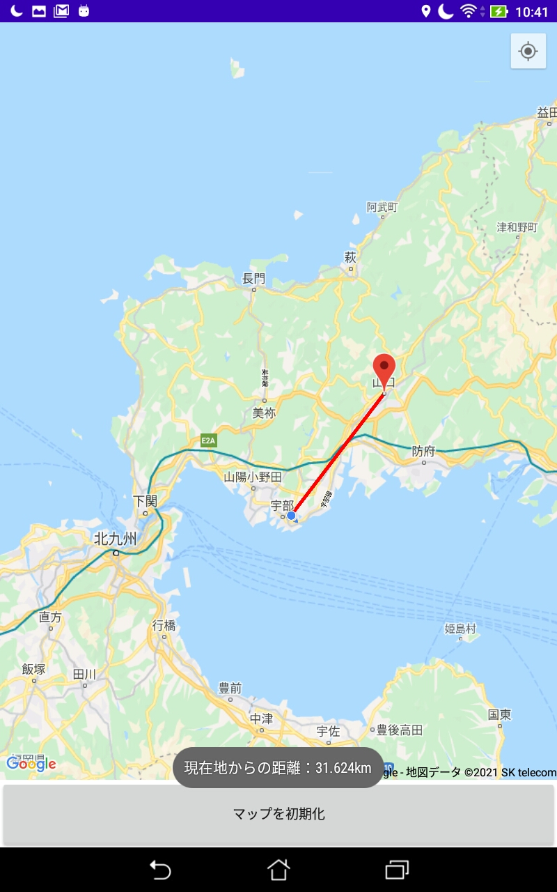
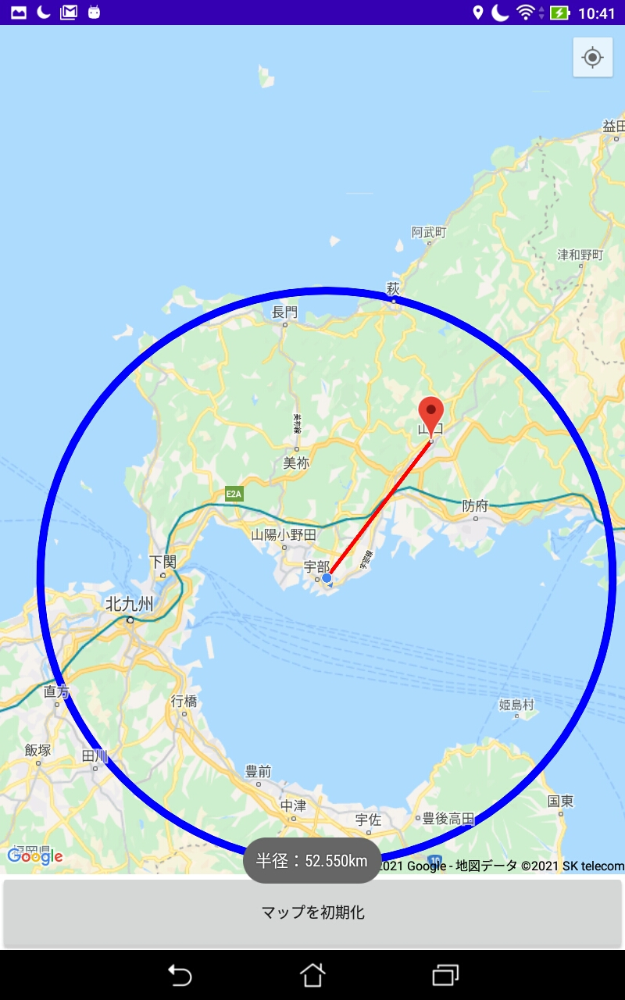

## GoogleMapAPIを用いた簡単なアンドロイドアプリ
### 機能
#### タップすると現在地からの線を描写


#### ロングタップで現在地からの円を描写


## メモ
以下のファイルにGoogleMapAPIのKEYを入力(入手の仕方は同ファイル内のコメントに記載)
```
MapSample/app/src/debug/res/values/google_maps_api.xml
```